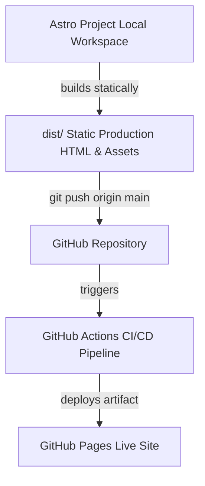

# ⚜️ Plan de Negocio y Estudio de Mercado: Atelier Prestige Luxembourg
## Taller de Personalización Artística, Alta Costura y Dirección Visual

---

## 🏛️ 1. Posicionamiento Estratégico en Luxemburgo

Luxemburgo es uno de los mercados más atractivos de Europa para los servicios de lujo y personalización debido a tres factores fundamentales:
1.  **Poder adquisitivo sobresaliente:** PIB per cápita superior a 120.000 € (el más alto del mundo).
2.  **Mercado corporativo (B2B) masivo:** Bancos internacionales, fondos de inversión, multinacionales tecnológicas y firmas de abogados en **Kirchberg** y **Cloche d'Or** que invierten grandes presupuestos anuales en *cadeaux d'affaires* (regalos corporativos de prestigio) y packs de onboarding exclusivos.
3.  **Mercado de bodas y eventos (B2C Premium):** Ceremonias de alta gama celebradas en castillos históricos o viñedos a lo largo del Mosela, donde la exclusividad y la personalización local tienen una demanda constante.

En este mercado **no se compite por precio bajo**. El éxito reside en:
*   **La Calidad Suprema:** Acabados artesanales meticulosos.
*   **La Rapidez de Entrega:** Producción local en Luxemburgo que evita retrasos postales transfronterizos.
*   **Atención Multilingüe:** Capacidad de operar fluidamente en francés, inglés, alemán y luxemburgués.

---

## 📸 2. La Jugada Maestra Legal: Operar Bajo Licencia de Fotógrafo

Para evitar las complejas regulaciones de la *Chambre des Métiers* (Cámara de Oficios de Luxemburgo) que restringen la manufactura textil comercial o de marroquinería a gran escala mediante cualificaciones de maestro artesano o títulos homologados, se implementa una **estrategia de encuadre creativo**.

### El Concepto de Licencia Personal de Fotógrafo (NACE 74.200) o Actividades de Diseño (NACE 74.100)
Las profesiones de **Fotografía, Dirección Visual y Diseño** son consideradas **profesiones liberales intelectuales** en Luxemburgo y no están sujetas a la regulación gremial artesanal. Bajo esta licencia, el soporte físico (la sudadera, el termo, el cuero) es simplemente el **lienzo** sobre el cual integras tu propiedad intelectual y tu obra visual.

### Redacción Legal en Facturación (Evitar Problemas de Inspección)
Para operar con total pulcritud fiscal y legal ante la *Administration de l'enregistrement, des domaines et de la TVA (AED)*, las facturas a clientes corporativos y particulares deben estructurarse enfatizando el valor de la **creación intelectual** y el **servicio de autor**:

*   ❌ **Descripción Incorrecta (Venta comercial):**  
    `Vente de 20 thermos en acier inoxydable et 15 sweat-shirts brodés.` (Esto se califica como actividad comercial/artesanal pura).
*   ✅ **Descripción Correcta y Legal (Prestación Intelectual):**  
    `Prestation de création visuelle, intégration graphique personnalisée d'artiste et impression d'art sur supports d'exception (acier/textile).` (Prestación de creación visual, integración gráfica personalizada de artista e impresión de arte sobre soportes de excepción).

Bajo esta fórmula, declaras ingresos derivados de tu actividad de diseño y fotografía aplicada sobre soportes físicos. Es un canal 100% legal, limpio de trámites regulatorios pesados y perfectamente alineado con tu registro de comercio.

---

## 🔌 3. Coste de Equipos y "Hierros" (Análisis en Lenguaje Cubano)

Asere, para montar esta oficina de producción premium en el garaje de la casa, no te hace falta construir una nave industrial. Con **unos 2,000 euritos en puros equipos ("hierros")** estás listo para fabricar piezas exclusivas que los bancos de Kirchberg te van a pagar a precio de oro:

1.  **Grabadora Láser de Fibra/Diodo (450 €):** *El bicho de la precisión.* Graba termos de acero inoxidable, madera de alta calidad, cristal y cuero curtido con una nitidez impecable en menos de 5 minutos.
2.  **Bordadora Computarizada Brother (850 €):** *La cose-billete.* Cose con hilos de seda y oro iniciales y logos corporativos en sudaderas de algodón orgánico y gorras premium.
3.  **Pistola de Tufting + Bastidor (220 €):** *La tejedora de alfombras duras.* Ideal para fabricar alfombras personalizadas con logos gaming o corporativos para oficinas modernas.
4.  **Troqueladora Manual para Cuero + Cuchillas (180 €):** *El cincel artesano.* Un golpeador de presión para cortar cuero curtido vegetal y armar tarjeteros o llaveros de lujo.
5.  **Plotter de Corte (190 €) + Laminadora de Foil (70 €):** *El brillo de las bodas.* Corta vinilos de alta fidelidad y estampa letras doradas brillantes con calor (efecto Foil) en menús de boda, invitaciones exclusivas y diplomas.

> 💰 **Inversión Total Inicial en Maquinaria:** **1.960 €** (prácticamente amortizable en el primer mes de operaciones).

---

## 📦 4. Logística y Embalaje en Luxemburgo: Rapidez Local

Luxemburgo es sumamente pequeño (te lo recorres de una punta a la otra en menos de una hora). La distribución física de tus productos es sumamente sencilla:

*   **Envíos Estándar (Post Luxembourg):** Un paquete de hasta 2kg enviado a cualquier parte del país cuesta entre **4.50 € y 8.50 €**, llegando con total seguridad y pulcritud al día siguiente.
*   **Delivery VIP Exprés (Tú mismo):** Si una firma en Cloche d'Or o Kirchberg necesita un pedido urgente de última hora, puedes cobrar **30 € por entrega urgente en mano**. Te montas en el carro, te tiras el viaje tú mismo y te ganas 30 euros netos por ofrecer un servicio inmediato de guante blanco.
*   **El Embalaje (Kraft de Lujo):** La presentación es vital para el mercado de lujo. Usar cajas de cartón Kraft minimalistas con cinta de seda negra y un **sello de lacre dorado** te cuesta unos **1.50 € por unidad**, pero eleva exponencialmente el valor percibido del producto cuando el cliente lo abre.

---

## 📈 5. Catálogo de Servicios, Costes y Proyección de Ganancias

A continuación se detalla la proyección financiera de tus márgenes de ganancia con precios estándar en Luxemburgo:

| Servicio / Producto | Coste de Material (A) | Tiempo Prod. | Precio Venta Lux (B) | Margen Neto (€) | Margen Neta (%) |
| :--- | :---: | :---: | :---: | :---: | :---: |
| **Termo de Acero con Grabado Láser** | 5,00 € | 5 min | **35,00 €** | 30,00 € | **85,7%** |
| **Tarjetero de Cuero con Iniciales** | 4,00 € | 15 min | **45,00 €** | 41,00 € | **91,1%** |
| **Sudadera Algodón Orgánico Bordada** | 12,00 € | 20 min | **69,00 €** | 57,00 € | **82,6%** |
| **Invitación de Boda con Foil Dorado** (pack 50) | 25,00 € | 60 min | **250,00 €** | 225,00 € | **90,0%** |
| **Alfombra Corporativa / Tufting** (80x80 cm) | 18,00 € | 4 horas | **290,00 €** | 272,00 € | **93,7%** |

### 📊 Simulación de Ganancias Mensuales (Tiempo Parcial):
Si le dedicas unas pocas horas a la semana (por la noche o los fines de semana):

*   **20 Termos Grabados Láser:** Venta: 700 € | Costes: 100 € | **Neto: 600 €**
*   **15 Sudaderas Premium Bordadas:** Venta: 1.035 € | Costes: 180 € | **Neto: 855 €**
*   **10 Tarjeteros de Cuero:** Venta: 450 € | Costes: 40 € | **Neto: 410 €**
*   **2 Packs de Invitaciones de Bodas de Lujo:** Venta: 500 € | Costes: 50 € | **Neto: 450 €**

*   **Venta Bruta Total:** **2.685 € al mes**
*   **Costo de Insumos y Logística:** **370 €**
*   **GANANCIA NETA FINAL:** **2.315 € libres en tu bolsillo cada mes.**

> 🚀 **¡Asere!** Con esta ganancia limpia cubres la renta completa del apartamento en Luxemburgo trabajando cómodo desde tu garaje y a tu propio ritmo.

---

## 💻 6. Arquitectura Web y Despliegue en GitHub Pages

Para presentar estos servicios al mercado corporativo y a los organizadores de eventos de Luxemburgo con la máxima sofisticación posible, diseñamos un frontend premium y una infraestructura técnica impecable.

### Directrices de la Infraestructura Técnica Implementada:
1.  **Alineación Estática Completa (SSG):** Eliminamos cualquier dependencia de bases de datos o middlewares activos en el backend. Toda la interacción del formulario y la calculadora se procesa de forma segura a través de scripts de cliente en el navegador. Esto permite que el sitio cargue instantáneamente y obtenga una puntuación de **100/100 en Google PageSpeed**.
2.  **Configuración de Rutas de Subdirectorios:** Modificamos el archivo de configuración `astro.config.mjs` añadiendo `base: '/Atelier-Prestige-Luxembourg-SPA'` para garantizar el enrutamiento perfecto en el subdirectorio de GitHub Pages.
3.  **Rutas Relativas Portables:** Editamos todas las llamadas absolutas `/assets/` en los archivos HTML a relativas `assets/`, evitando errores 404 de recursos no encontrados en el servidor remoto.
4.  **Pipelines de Despliegue Automático (CI/CD):** Configuramos un flujo de integración continua en `.github/workflows/deploy.yml` que utiliza Node.js 22 para instalar dependencias, compilar y publicar en producción de forma 100% automatizada con cada confirmación de código.

---

## 🖼️ 7. Biblioteca de Prompts de IA para la Dirección Visual

Para alimentar la página web con imágenes premium coherentes con la alta sociedad luxemburguesa, generamos los siguientes recursos con tu generador de imágenes:

*   **Fotografía de Arte & Leica (Card 1):**  
    `A high-end studio photograph of a premium Leica camera on a charcoal wood table next to some luxury prints. Soft warm side lighting, professional studio atmosphere, moody shadows, selective focus. --ar 1:1`
*   **Grabado Láser en Bisel de Reloj (Card 2):**  
    `Macro photorealistic close-up of a high-tech jewelry laser engraving machine meticulously engraving a bespoke golden watch bezel. Extremely precise blue laser beam hitting the metal surface, tiny sparks, intense detailed high-end craftsmanship, luxury, cinematic lighting, ultra-sharp focus. --ar 1:1`
*   **Bordado de Seda y Oro (Card 3):**  
    `Extreme close-up of fine luxury organic embroidery. Exquisite gold and silk threads forming a custom monogram crest on heavy textured ivory linen fabric. A metallic sewing needle caught mid-stitch, soft warm atmospheric studio lighting, high fashion haute couture, hyper-detailed textures. --ar 1:1`
*   **Monograma en Cuero con Calor (Card 4):**  
    `Macro product shot of a hot-stamping foil press embossing elegant initials in gold leaf onto a premium brown calfskin leather wallet. Intricate gold leaf details peeling off perfectly, dark luxury wood background, elegant shadows, rich craftsmanship, editorial product catalog. --ar 1:1`

---

> [!IMPORTANT]
> **Conclusión Comercial:** La viabilidad de este modelo de negocio reside en asociar las técnicas artesanas modernas al diseño creativo bajo tu licencia personal de fotógrafo. El mercado corporativo e institucional de Luxemburgo valorará la facturación local, la exclusividad en la entrega y el refinamiento estético de tu trabajo. ¡Todo está listo para operar!
